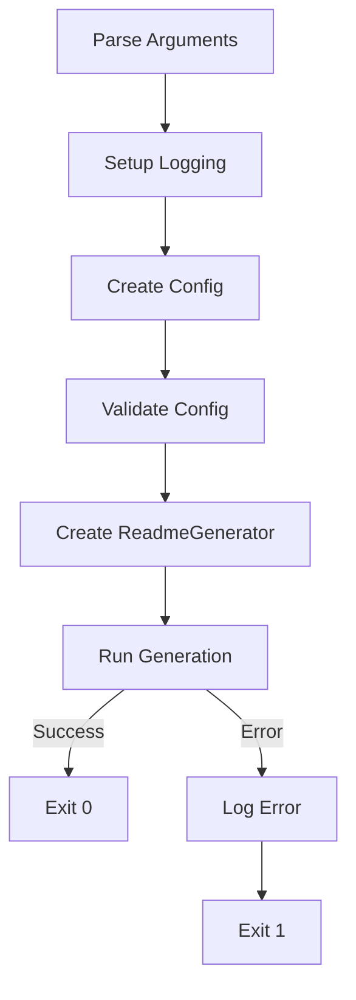

# main.py

## Key Components

### Command Line Interface
It uses `argparse` module to provide a flexible CLI with the following options:

| Option | Required | Default | Description |
|--------|----------|---------|-------------|
| `-r, --repo` | Yes | - | Target repository directory to analyze |
| `-c, --collection` | No | "default" | Prompt collection to use for generation |
| `-s, --step` | No | None | Starting step number for generation |
| `-o, --only` | No | False | Run only the specified step |
| `-m, --model` | No | "gpt-4o" | OpenAI model to use |
| `--keep-steps` | No | False | Keep intermediate step output files |

#### Logging Configuration (`setup_logging`)
```python
def setup_logging():
    """Set up basic logging configuration."""
    logging.basicConfig(
        level=logging.INFO,
        format="%(levelname)s: %(message)s",
        handlers=[logging.StreamHandler()],
    )
```
- Configures logging

#### Main Execution Flow (`main`)
1. Parses command-line arguments
2. Sets up logging
3. Creates a `GeneratorConfig` instance with parsed arguments
4. Initializes and runs the `ReadmeGenerator`
5. Handles any exceptions during execution

## Integration Points

### Configuration (`config.py`)
- Creates a `GeneratorConfig` instance with CLI arguments
- Configuration validates paths and directories
- Example:
  ```python
  config = GeneratorConfig(
      target_repo=args.repo,
      prompt_collection=args.collection,
      start_step=args.step,
      only_mode=args.only,
      model=args.model,
      keep_steps=args.keep_steps,
  )
  ```

### README Generation (`readme_generator.py`)
- Instantiates `ReadmeGenerator` with configuration
- Triggers the generation process via `generator.run()`
- Handles any generation errors

## Error Handling
- Catches and logs all exceptions during execution
- Provides error messages through logging

## Flow Diagram
